# SVM Classifier

A Support Vector Machine (SVM) classifier built from scratch in C++ using the SMO (Sequential Minimal Optimization) algorithm.

## Features

- SVM with SMO training algorithm and incremental error-cache update (O(n) per pair update)
- Three kernel functions: Linear, RBF, Polynomial
- Z-score feature normalisation
- Evaluation: accuracy, confusion matrix, precision, recall, F1 score
- 5-fold cross-validation
- Kernel comparison
- Hyperparameter grid search
- Multi-dataset pipeline driver (runs over all configured `DatasetSpec` entries)

## Datasets

The classifier runs the full pipeline (load → normalise → split → train → 5-fold CV → kernel comparison → grid search → optimised retrain) on three UCI binary-classification datasets:

| Dataset | Samples | Features | Positive / Negative |
|---|---|---|---|
| [Ionosphere](https://archive.ics.uci.edu/dataset/52/ionosphere) | 351 | 34 | Good / Bad radar return |
| [Banknote Authentication](https://archive.ics.uci.edu/dataset/267/banknote+authentication) | 1372 | 4 | Forged / Genuine |
| [Spambase](https://archive.ics.uci.edu/dataset/94/spambase) | 4601 | 57 | Spam / Ham |

Grid search runs on Ionosphere and Banknote; Spambase skips it (`run_grid_search=false` in its `DatasetSpec`) — even with the O(n) incremental SMO, a 400-fit grid at 4601 samples runs into hours. The full 3-dataset pipeline finishes in about 90 seconds on a typical desktop CPU.

Download the three datasets:

```bash
mkdir -p data
curl -sL "https://archive.ics.uci.edu/ml/machine-learning-databases/ionosphere/ionosphere.data" -o data/ionosphere.data
curl -sL "https://archive.ics.uci.edu/ml/machine-learning-databases/00267/data_banknote_authentication.txt" -o data/banknote.txt
curl -sL "https://archive.ics.uci.edu/ml/machine-learning-databases/spambase/spambase.data" -o data/spambase.data
```

## Build and Run

Requires CMake and a C++17 compiler.

```bash
cmake -B build
cmake --build build
./build/svm_classifier | tee resources/run_output.txt
```

### Generate Figures

After running the classifier, generate publication-quality plots from the output:

```bash
python3 scripts/plot_results.py
```

This reads `resources/run_output.txt`, splits it by `=== DATASET:` markers, and saves a per-dataset set of figures to `figures/` with the dataset slug as filename prefix. Ionosphere and Banknote each get the full set of six; Spambase (grid search disabled) only gets `cv_folds` and `kernel_comparison_default`. Requires Python 3 with `matplotlib` and `numpy`. See [`docs/usage.md`](docs/usage.md#generate-figures) for the full filename-pattern table.

## Results

The figures committed in [`figures/`](figures/) are the most recent output of the pipeline. Click a dataset to expand its plots.

<details open>
<summary><strong>Ionosphere</strong> — 351 samples, 34 features (full grid search)</summary>

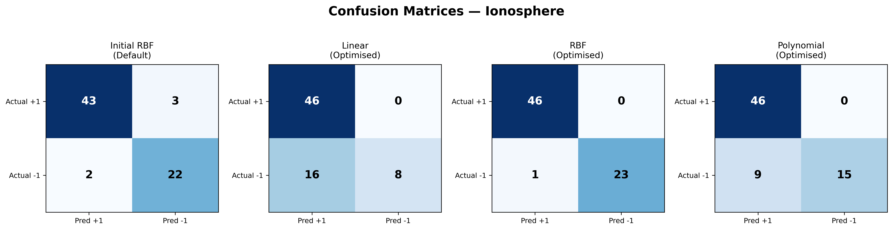
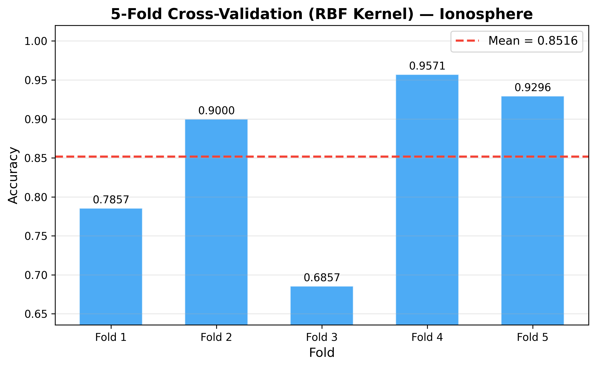
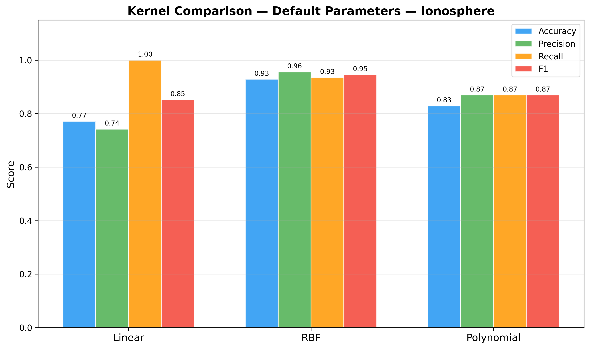
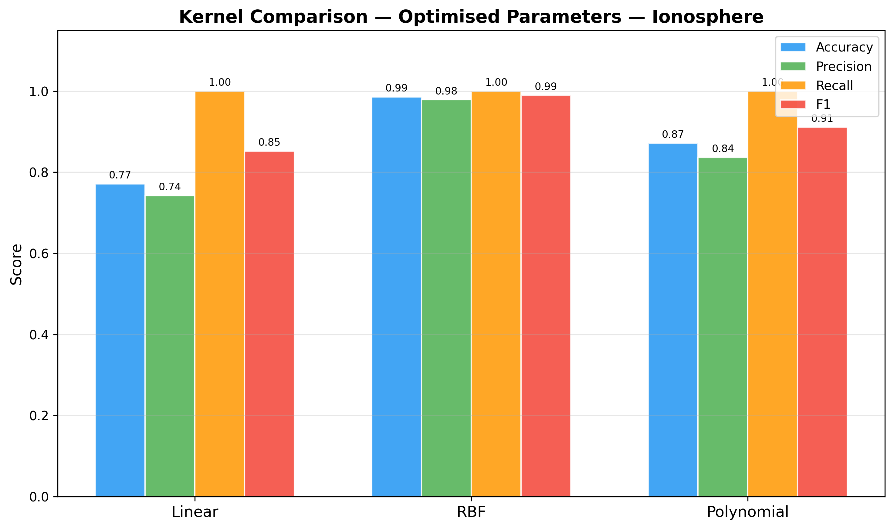
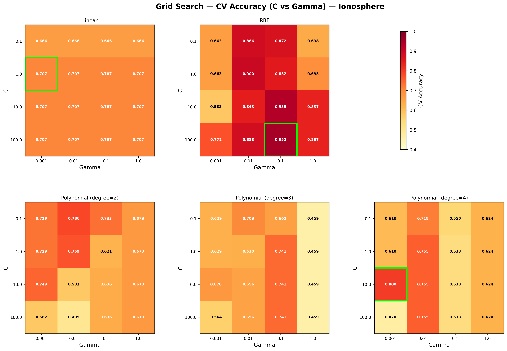
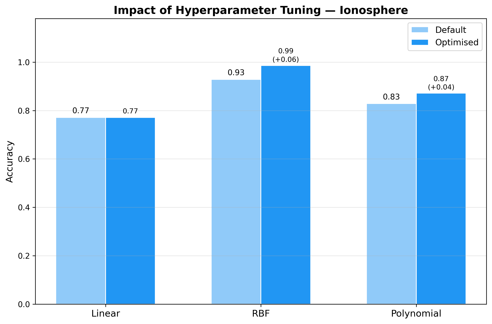

</details>

<details>
<summary><strong>Banknote Authentication</strong> — 1372 samples, 4 features (full grid search)</summary>

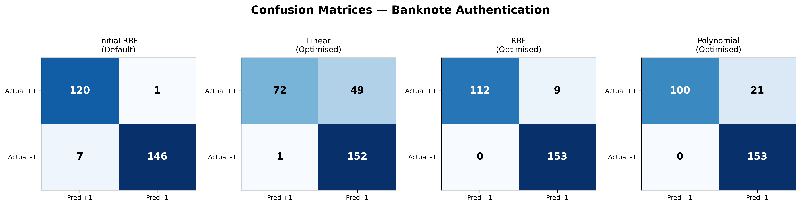
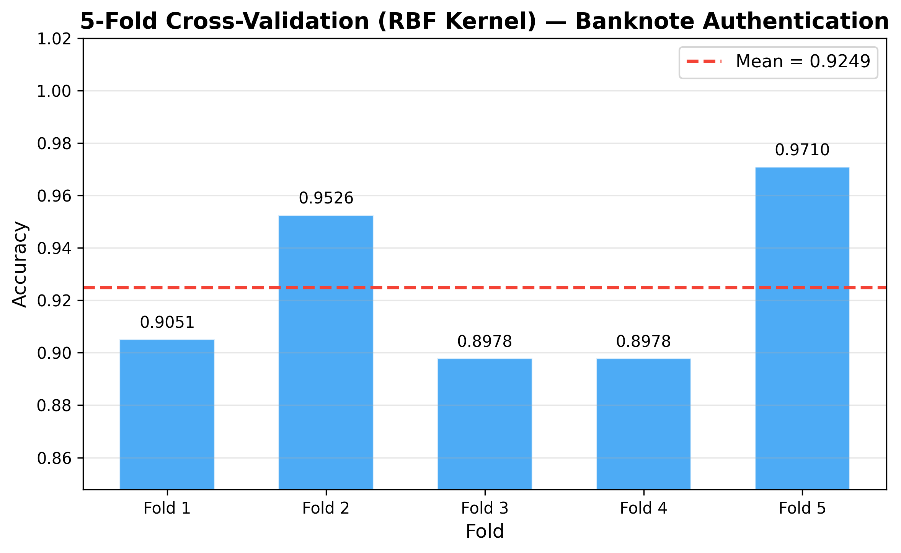
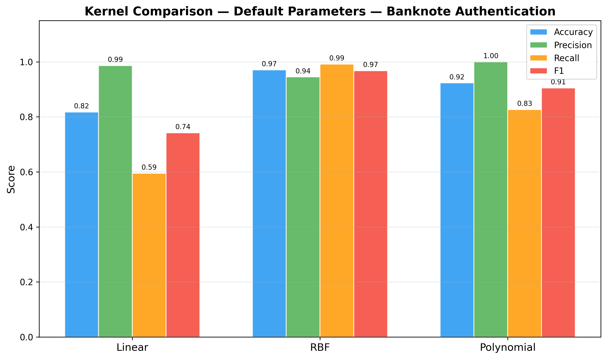
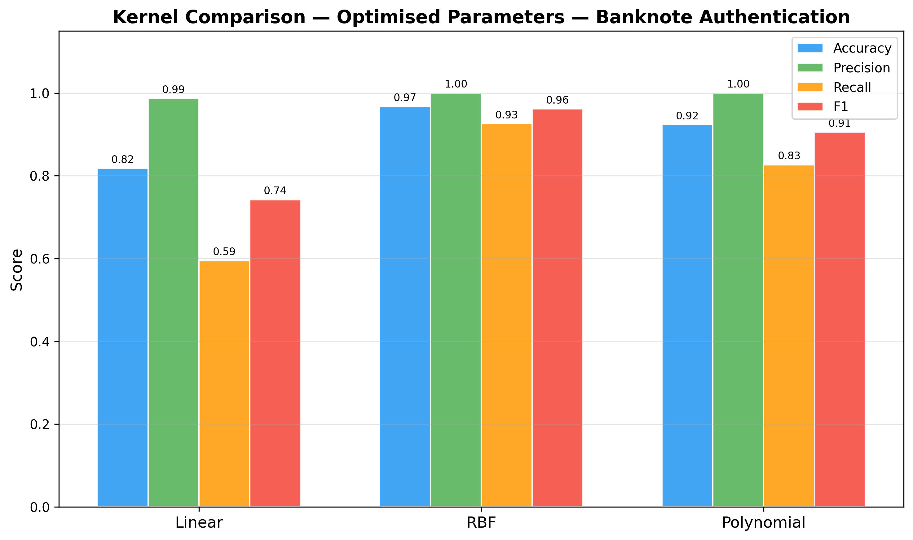
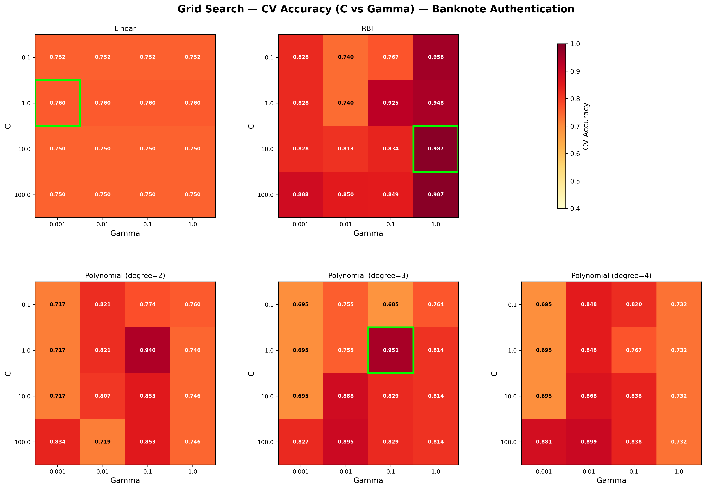
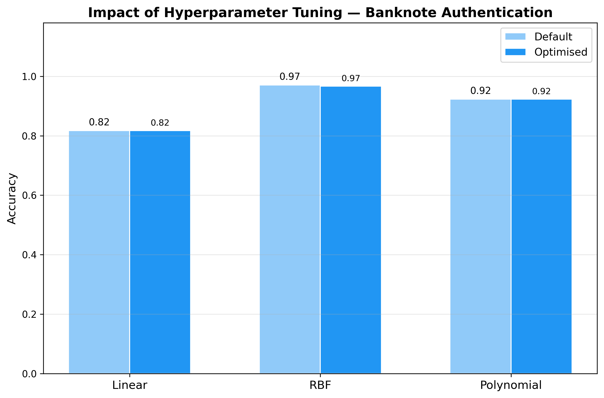

</details>

<details>
<summary><strong>Spambase</strong> — 4601 samples, 57 features (grid search disabled)</summary>

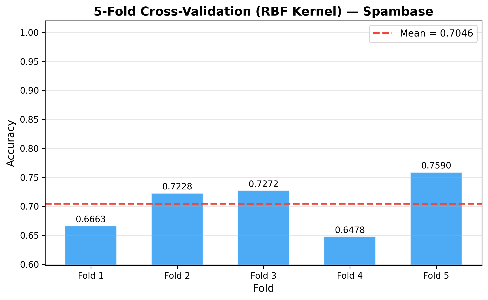
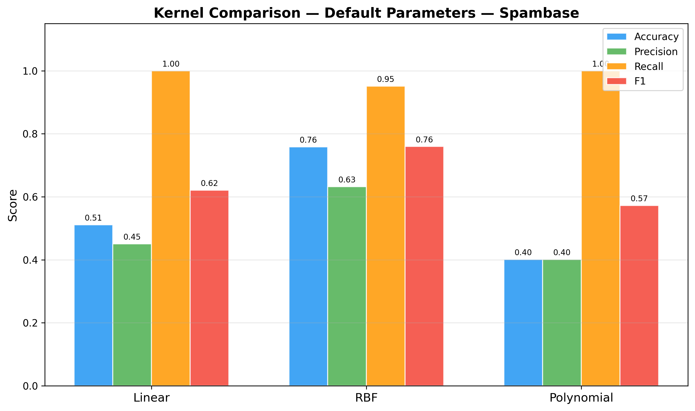

</details>

## Documentation

See the [`docs/`](docs/) folder for detailed documentation:

- [Architecture](docs/architecture.md) — project structure and module responsibilities
- [Algorithm](docs/algorithm.md) — SVM dual formulation, SMO training, kernel functions
- [Usage](docs/usage.md) — build, run, and output walk-through

The full assignment report is kept locally under `resources/` (not tracked in this repository).

## License

[MIT](LICENSE)
